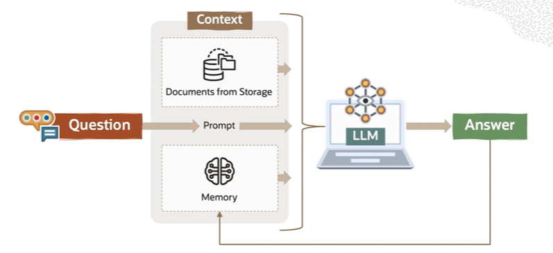

# Chatbot

One of the most popular and useful LLM application is a **chatbot** that can answer questions given a set of custom documents.

## Chatbot Architecture

1. Ask chatbot a question
2. Relevant documents from storage are retrieved and used as context
3. Prior questions and answes are also used as context
4. LLM answers using context and question

