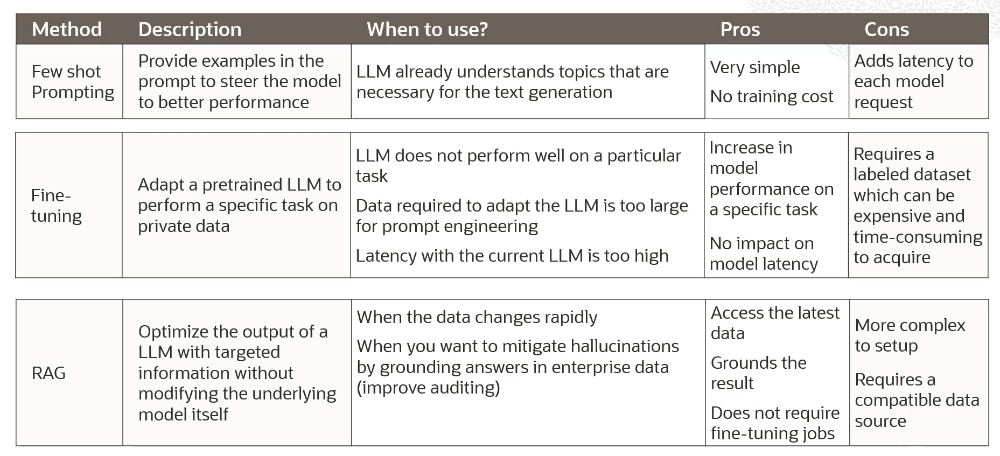
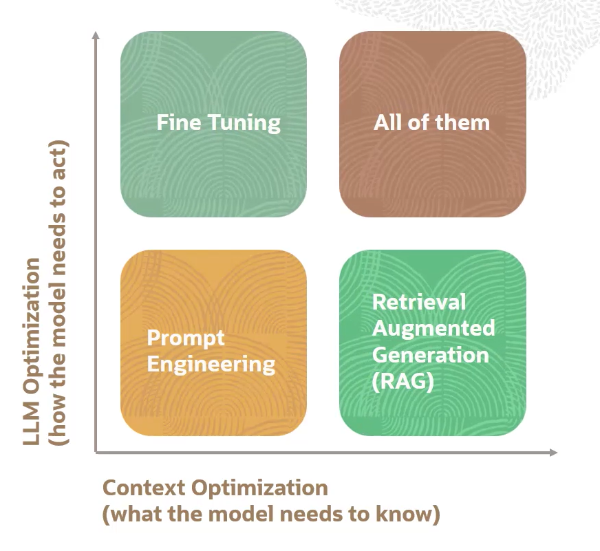

# Customize LLMs with your data

Trainining LLMs from scratch is **not a good idea**.

There are 3 mains reasons:
- **Cost**
    - it's expensive
    - $1M per 10B parameters to train 
- **Data**
    - a lot of data is needed
        - Meta Llama-2 7B model was trained on 2 trillion tokes
    - a lot of **annotated data** is needed
- **Expertise**
    - pretraining models is hard
    - it requires a **thorough understanding of model performance**
        - monitor for it
        - detect and mitigate hardware failures
        - understand the limitations of the model

## What are the options?

1. **In-context Learning** and **Few Shot Prompting**
    - user provides demonstration in the prompt to teach the model how to perform certain tasks
    - popular techniques includes **Chain of Thought Prompting**
    - main limitation is the model context lenght (e.g. 4096 tokens)
2. **Fine-tuning a pretrained model**
    - optimize a model on a smaller domain-specific dataset
    - recommended when a pretrained model doesn't perform your task well or when you want to teach it something new
    - adapt to specific style/tone and learn human preferences
    - main advantages:
        - improve model on specific tasks
        - improve model efficiency
3. **Retrieval Augmented Generation (RAG)**
    - language model is able to query **enterprise knowledge** bases (e.g. databases, wikis, vector database, etc. ) to provide **grounded responses**
    - RAGs do not require fine-tuning of custom models

## Which method to choose?

- **Prompt Engineering** 
    - It is the easiest to start with
    - Test and learn quickly
- **Retrieval Augmented Generation (RAG)**
    - If you need more context
- **Fine Tuning**
    - If you need more instruction following
    

