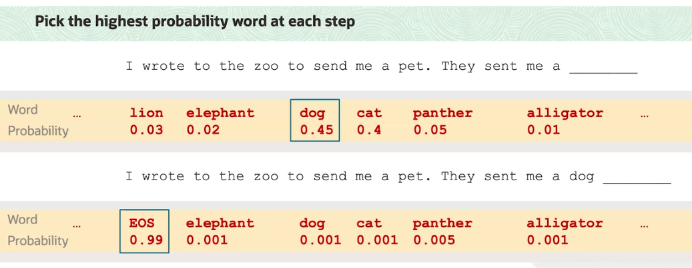
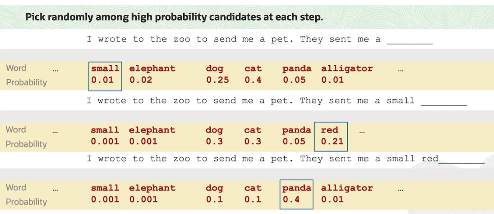

# Decoding

**Decoding** is the process of generating text with an LLM.

Decoding happens **one word at a time**. The model is not emitting whole sentences or documents in one step.

Specifically:
- some input text is given to the model
- the model produces a distribution over words in its vocabulary
- the model selects **one word** (according to distribution)
- the word gets appended to the input
- the revised input is feeded back into the model
- the process is performed again ...

Once we compute the distribution over words in the vocabulary, how do we actually pick a word to emit? 

Three types of the **most common forms of decoding**:
- greedy decoding
- nucleus sampling (non-deterministic)
- beam search

## Greedy Decoding

The simplest but effective strategy is **greedy decoding**. We simply pick the word in the vocabulary with the **highest probability**.

When we send the input with `dog` appended to the end of it back to the model, the probabilities on the remaining words change. We see a new token, `EOS`, which stands for *End Of Sentence* (or *End Of Sequence*) with very high probability.  After the `EOS` token, the model is done generating, and the output is returned.

## Non-Deterministic Decoding

Greedy decoding is only the simplest decoding mechanism. In fact, there are many different styles of decoding, some of which are non-deterministic. In other words, they include some **random sampling**.

When decoding with a non-deterministic strategy, there's an important parameter to know about, which is called **temperature**. Temperature is a (hyper) parameter that **modulates the distribution over vocabulary**. 

Specifically:
- when temperature is **decreased**, the distribution is more **peaked** around the most likely word
- when temperature is **increased**, the distribution is more **flattened** over all words

When modulating the temperature parameter, **the relative ordering of the words by probability stays the same**. In other words, no matter how we change the temperature, the highest probability word will always have the highest probability. The way that temperature affects the output text is that, when temperature increases and your decoding with a non-deterministic strategy, you're more likely to emit **rarer words**. This is typically associated with more creative and even interesting output. 

When answering factoid questions, you might imagine that we want greedy decoding. On the other hand, if we want the model to generate a story, we want to crank up the temperature and sample some rare words from time to time in order to add intrigue and unpredictability.

## Beam Search

In **Beam Search** we actually generate multiple similar sequences simultaneously and continually prune the sequences with low probability. Beam search is very interesting and helpful because it is decidedly not greedy but ends up outputting sequences that have higher joint probability than the sequences that are output as a result of greedy decoding.
