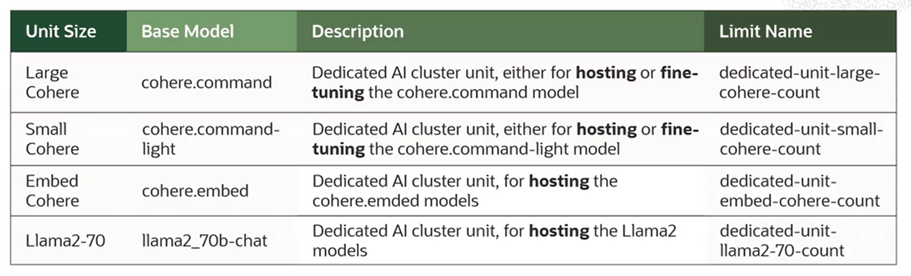
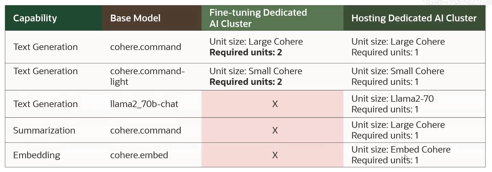
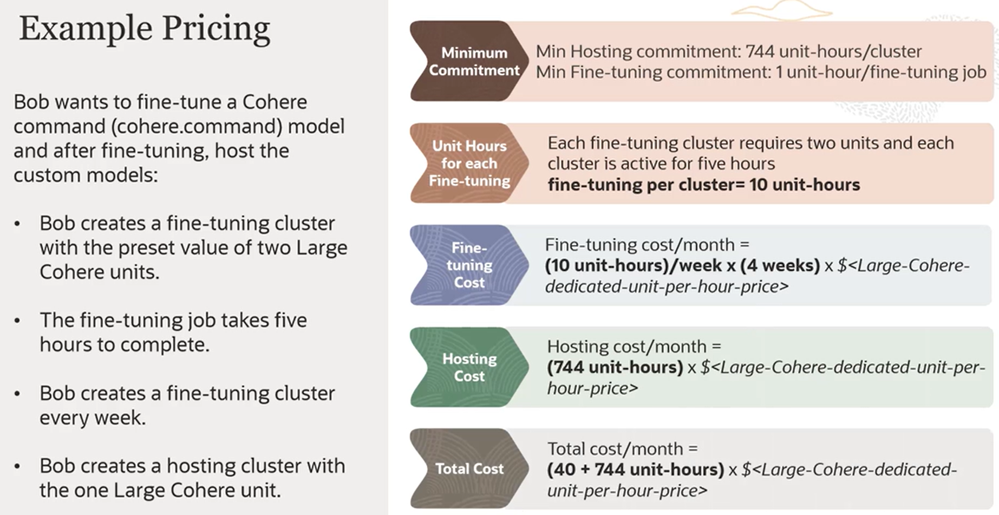

# Dedicated AI Clusters

Dedicated AI cluster comes in these 4 unit types.

## Units Sizing

- **Fine-Tuning Dedicated AI Cluster**
    - it requires **two units** for the base model chosen
    - fine-tuning a model requires more GPUs than hosting a model
    - the same fine-tuning cluster can be used to fine-tune several models
- **Hosting Dedicated AI Clusters**
    - it requires **one units** for the base model chosen
    - the same cluster can host up to 50 different fine-tuned models (using T-Few fine tuning)
    - it can create up to 50 endpoints that point to the different models hosted on the same hosting cluster 

## Example Pricing

- Minimum Hosting Commitment: **744 unit-hours/clusters**
- Minimum Fine-Tuning Commitment: **1 unit-hour/fine-tuning job**

