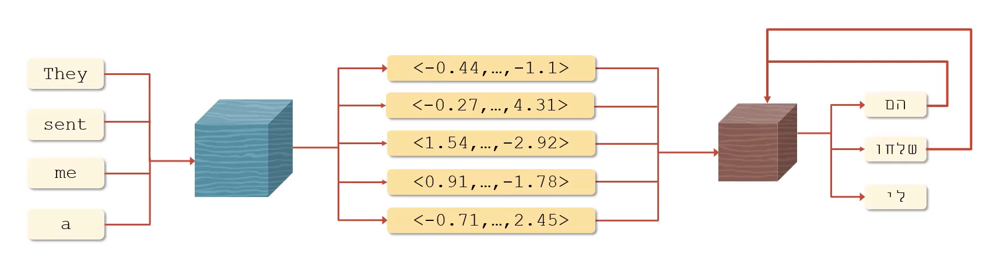
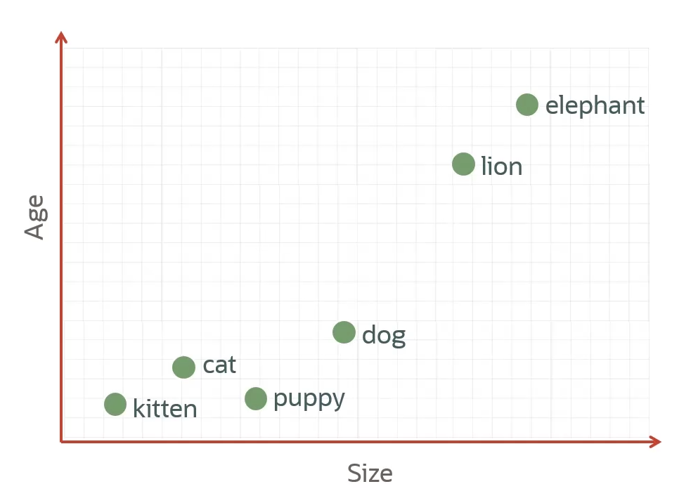
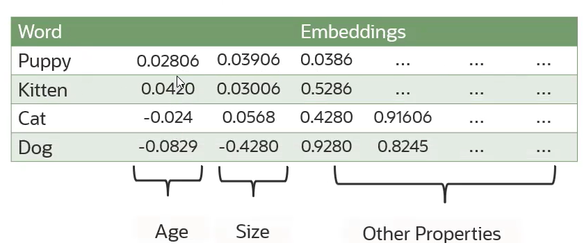
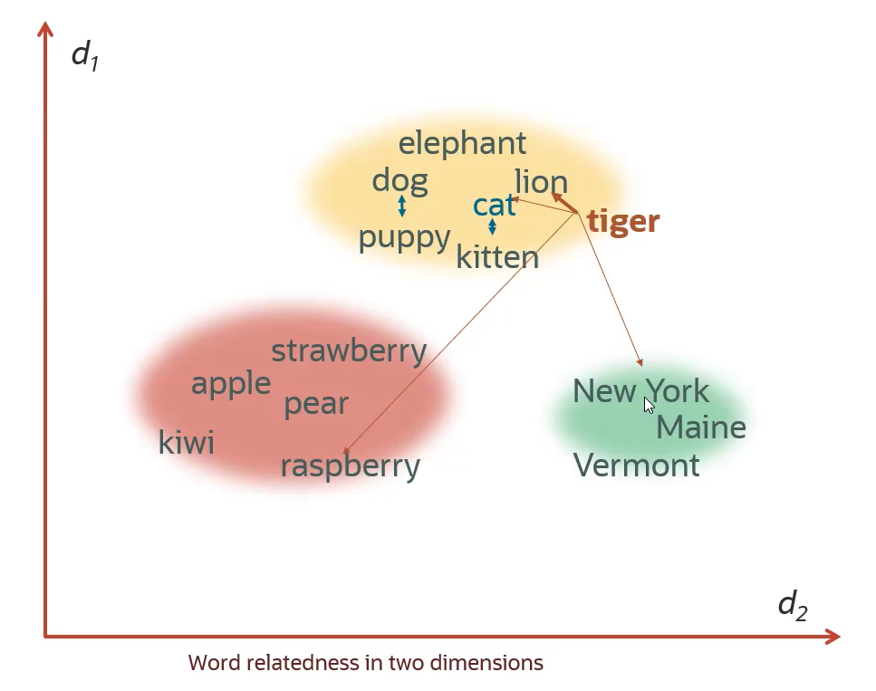
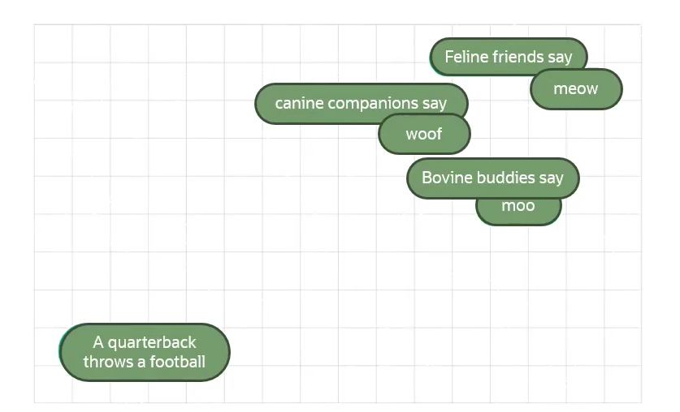
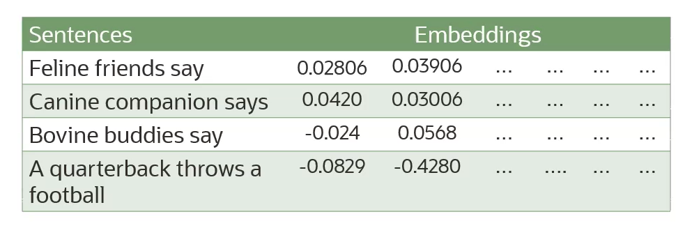
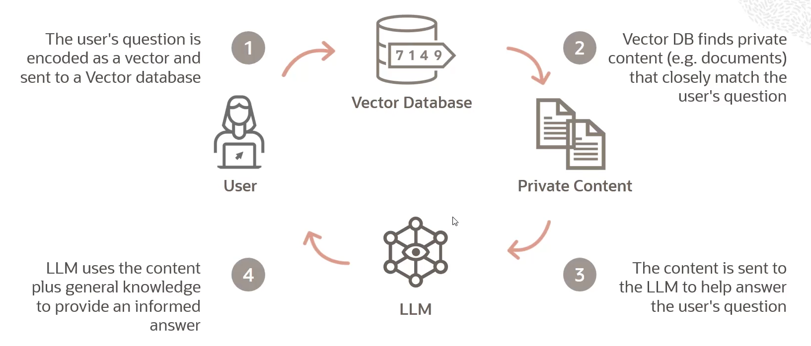

# Embedding Models

Embeddings are **numerical representations** of a piece of text converted to number sequences. Embeddings make it easy for computers to understand the relationship between pieces of text.

A piece of text could be:
- a word
- a phrase
- a sentence
- a paragraph
- an entire document

**Encoders** are designed to take a piece of text and convert it into a vector. In the image, there is a vector for each of the words, and there is also a vector representation for the sentence. 

The real use case is **translation**, which is a sequence-to-sequence task. 

## Word Embeddings

Word embeddings capture **properties** of the word.

Actual embedding represent more properties (coordinates) that just two.

## Semantic Similarity

The **numerical similiarity** is a number that measures the similarity between two embeddings (which are numbers). *Cosine Similarity* and *Dot Product Similarity* can be used to compute the numerical similiarity.

Embeddings that are numerically similar are also **semantically similar**. Semantically similar basically means how close their meaning is or how closely they are related. 

 
## Sentence Embeddings

A sentence embedding associates every sentence with a vector of numbers, similar to a word embedding. 

Similar sentences are assigned to similar vectors, different sentences are assigned to different vectors.

*E.g. The embedding vector of a phrase such as "canine companions say" will be more similar to the embedding vector of "woof" than that of a "meow." "Meow" would be closer to a "feline friends say."*

## Embeddings Use Case

One of the main challenges faced by today's generative models or embedding models is their inability to connect with companies's data. 

A promising approach to overcoming this limitation is **Retrieval-Augmented Generation (RAG)**. 

So how fundamentally RAG works ? You can take a large corpus of documents, break it into chunks or paragraphs, and generate the embedding for each paragraph, and store all the embeddings into a **vector database**. Vector databases are capable of automating the *cosine similarity* and doing *nearest-match* searches through that database for some search embedding.

*Let's say you have a user who has some question which cannot be answered by LLM. Maybe it's related to your customer support calls or something. So the user question is encoded as a vector and sent to the vector database. Now vector database can run a nearest match to identify the most closely associated documents or paragraphs. It finds the private content which closely matches the user query and then it takes those documents (or those paragraphs) and it inserts those into a prompt to be sent to the LLM. **The basic idea is to help answer the user question by changing the prompt**. Then the LLM uses the content which has been given by the vector database plus its general knowledge to provide an informed answer.*

## Embedding Models

- `embed-english-v3.0` model from Cohere
    - converts english text into vector embeddings
    - model creates 1024-dimensional vector for each embedding
    - max 512 tokens per embedding
- `embed-english-light-v3.0` model from Cohere
    - smaller and faster version of `embed-english-v3.0`
    - model creates 384-dimensional vector for each embedding
    - max 512 tokens per embedding
- `embed-multilingual-v3.0` model from Cohere
    - state-of-the-art multilingual embedding model
    - converts text in over 100 languages into vector embeddings
    - model creates 1024-dimensional vector for each embedding
    - max 512 tokens per embedding
- `embed-multilingual-light-v3.0` model from Cohere
    - smaller and faster version of `embed-multilingual-v3.0`
    - model creates 384-dimensional vector for each embedding
    - max 512 tokens per embedding

One of the key improvements in **embed-v3** from Cohere is its ability to evaluate how well a query matches a document's topic and assess the overall quality of the content. This means that it can rank the highest-quality documents at the top, which is especially helpful when dealing with noisy data sets. It can significantly improve retrievals for RAG systems. 