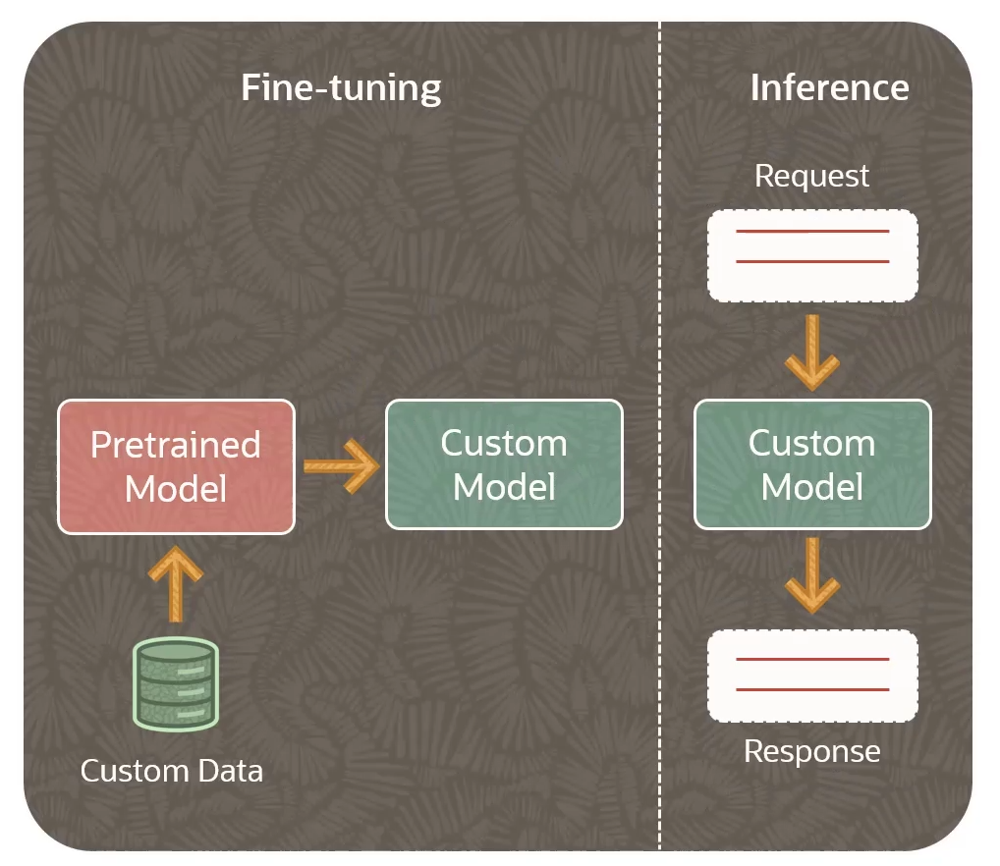
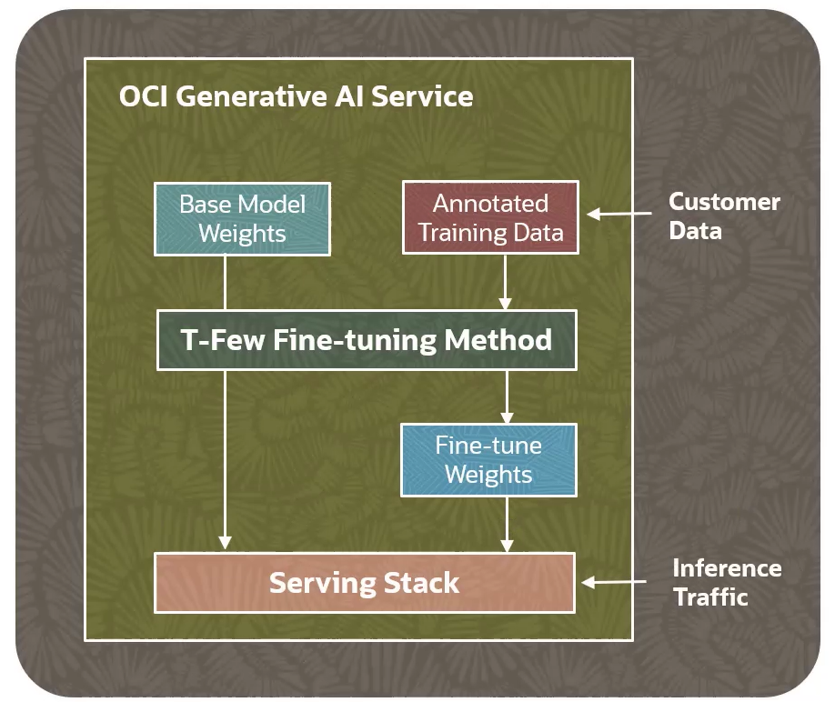
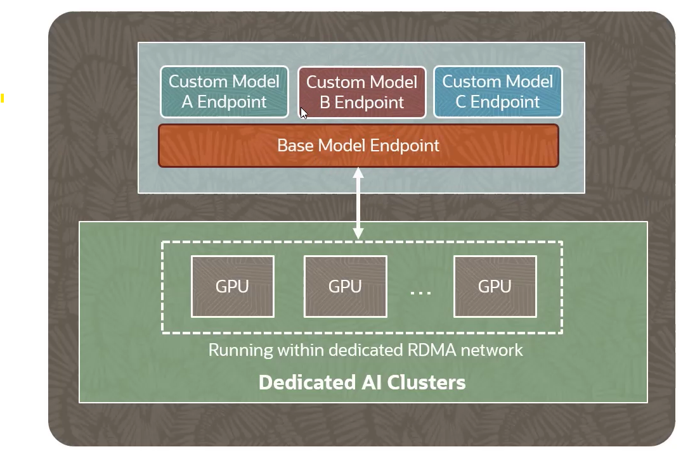
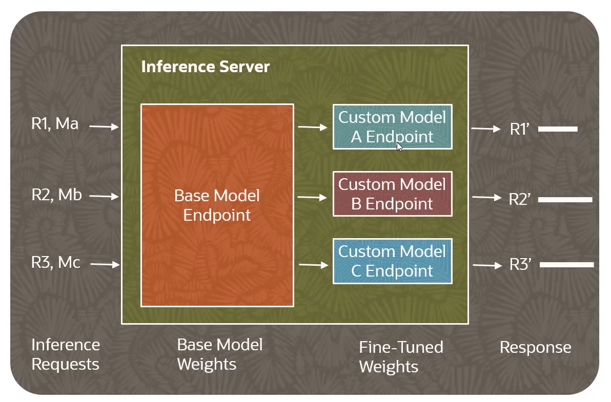

# Fine-Tuning and Inference in OCI Generative AI

**Fine-Tuning** is basically taking a pre-trained foundational model and providing additional training using custom data.

A **custom model** is a model that you create by using a pre-trained model as a base and using your own data set to fine tune that model.

In traditional ML terminology, *inference* refers to the process of using a trained machine learning model to make predictions or decisions based on new input data. In case of LLMs, **inference refers to the model receiving new text as input and generating output text** based on what it has learned during training and fine-tuning. 

## Fine-Tuning workflow in OCI Generative AI

1. Create a **Dedicated AI Cluster** (cluster type: Fine-Tuning)
2. Gather Training Data
3. Kickstart Fine-Tuning process
4. Fine-Tuned (Custom) Model gets created

## Inference workflow in OCI Generative AI

Model Endpoint is a designated point on the dedicated AI cluster where the LLM can accept user request and send back responses such as models generated text.

1. Create a **Dedicated AI Cluster** (cluster type: Hosting)
2. Create the Endpoint
3. Serve Custom Model

## Dedicated AI Clusters

A Dedicated AI Clusters is a **single tenant deployment** where the GPUs in the cluster only host your custom model.

The are tow kinds of clusters:
- **fine-tuning**
    - used for training a pre-trained foundational model
- **hosting**
    - used for hosting a custom model endpoint for inference

## T-Few Fine-Tuning

Traditionally, Vanilla fine-tuning involves updating the weights of all (most) the layers in the model requiring longer training time and higher serving (inference) costs.

**T-Few Fine-Tuning** selectively updated **only a fraction of the model's weights**. It is an additive *Few-Shot Parameter Efficient Fine Tuning (PEFT)* technique that inserts additional layers comprising roughly 0.01% of the baseline model size. The weight updates are localized to the T-Few layers during the fine-tuning process. 

Isolating the weight updates to the T-Few layers **significantly reduce the overall training time and the cost** compared to updating all the layers with something like Vanilla fine-tuning. 

T-Few Fine-Tuning Process:
1. T-Few fine-tuning process begins by utilizing the **initial weights of the base model** and an **annotated training dataset**
2. Annotated data comprises of input-output pairs employed in supervised training
3. Supplementary set of model weights is generated (~0.01% baseline model's size)
4. **Updates to the weights are confined to a specific group of transformer layers** (T-Few transformer layers) saving substantial training time and cost

## Inference costs

**Inference is computationallly expensive**. Every time you're sending a request, you're getting a response back, there is cost associated with that.

In case of OCI Generative AI service and dedicated AI cluster, each hosting cluster can host one base model endpoint and up-to-n fine-tuned custom model endpoints that can serve requests concurrently. 

This approach of **models sharing the same GPU resources reduces the expenses** associated with inference. Endpoints can be de-activated to stop serving requests and re-activated later.

## Inference serving 

GPU memory is limited so **switching between models can incur significant overhead** due to reloading the full GPU memory. 

The overhead includes the time and computational resources required to transfer the model data from the system memory to the GPU memory, as well as any initialization or setup tasks needed to prepare the GPU for processing with the new model.

When custom models share the majority of the weights (i.e. *parameters sharing*), they can be efficently deployed on the same GPUs in a dedicated AI clusters. This architecture results in **minimal overhead when switching between models derived from the same base model**.

