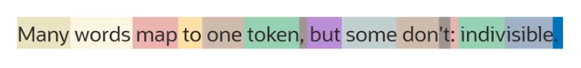

# Generation Models

LLMs understand **tokens** rather than characters. 

One token can be:
- an entire word (e.g. *apple*) 
- a part of a word (e.g. *friendship* is made up of two tokens: *friend* and *ship*)
- a punctuation symbol

Number of tokens per word depend on the complexity of the text:
- for **simple texts**: 1 token/word (avg)
- for **complex texts** (less common words): 2/3 token/word (avg)

This is an example of how large language models take text as input.

## Pretrained generation models in Generative AI

- `command` model from Cohere
    - highly performant, instruction-following conversational model 
    - model parameter: 52B
    - context window(*): 4096 tokens
    - use cases: 
        - text generation
        - text summarization
        - conversation (chat) 
- `command-light` model from Cohere
    - small, faster version of `command`, but almost as capable
    - model parameter: 6B
    - context window(*): 4096 tokens
    - use when speed and cost are important (give clear instruction for best results)
- `llama-2-70b-char` model from Meta
    - highly performant, open-source model optimized for dialogue use cases 
    - model parameter: 70B
    - context window(*): 4096 tokens
    - use cases: 
        - text generation
        - conversation (chat) 

(*) A model's *context window* refers to the number of tokens it's capable of processing at one time. It's the sum of input and output tokens for that particular model.

## Generation Models Parameters

- **Maximum output tokens**
    - max number of tokens model generates per response
    - OCI hard limit: 4000
- **Temperature**
    - it determines how creative the model should be 
    - it controls the output of generation models (close second to *prompt engineering*)
- **Top p** and **Top k**
    - two additionals ways to pick up the output tokens besides temperature
- **Presence**/**Frequency penalty**
    - it assigns a penalty when a token appears frequently and produces repetitive text
- **Show likelihoods**
    - it determines how likely it would be for a token to follow the current generated token