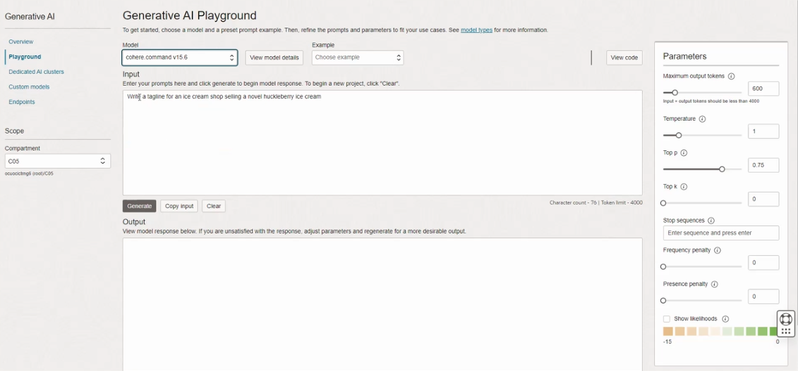
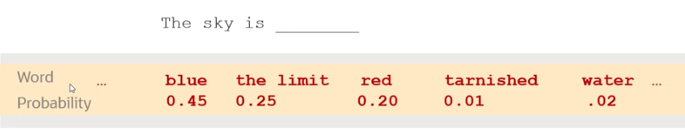
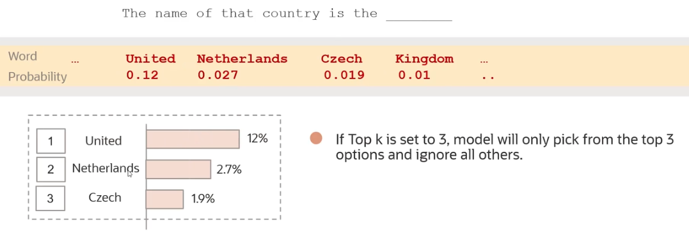
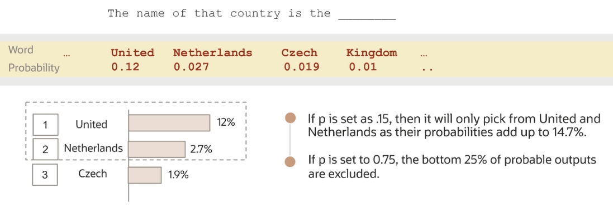
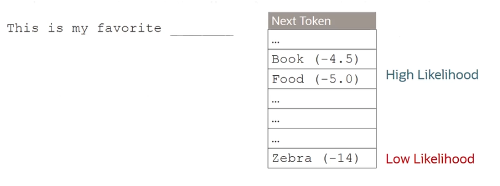

# Generation Models

LLMs understand **tokens** rather than characters. 

One token can be:
- an entire word (e.g. *apple*) 
- a part of a word (e.g. *friendship* is made up of two tokens: *friend* and *ship*)
- a punctuation symbol

Number of tokens per word depend on the complexity of the text:
- for **simple texts**: 1 token/word (avg)
- for **complex texts** (less common words): 2/3 token/word (avg)

This is an example of how large language models take text as input.

## Pretrained generation models in Generative AI

- `command` model from Cohere
    - highly performant, instruction-following conversational model 
    - model parameter: 52B
    - context window(*): 4096 tokens
    - use cases: 
        - text generation
        - text summarization
        - conversation (chat) 
- `command-light` model from Cohere
    - small, faster version of `command`, but almost as capable
    - model parameter: 6B
    - context window(*): 4096 tokens
    - use when speed and cost are important (give clear instruction for best results)
- `llama-2-70b-char` model from Meta
    - highly performant, open-source model optimized for dialogue use cases 
    - model parameter: 70B
    - context window(*): 4096 tokens
    - use cases: 
        - text generation
        - conversation (chat) 

(*) A model's *context window* refers to the number of tokens it's capable of processing at one time. It's the sum of input and output tokens for that particular model.

## Generation Models Parameters

- **Maximum output tokens**
    - max number of tokens model generates per response
    - OCI hard limit: 4000
- **Temperature**
    - it determines how creative the model should be 
    - it controls the output of generation models (close second to *prompt engineering*)
- **Top k/p**
    - two additionals ways to pick up the output tokens besides temperature
- **Frequency/Presence penalty**
    - it assigns a penalty when a token appears frequently and produces repetitive text
- **Show likelihoods**
    - it determines how likely it would be for a token to follow the current generated token

## Temperature

**Temperature** is a (hyper) parameter that controls the randomness of the LLM output. 

The temperature setting basically tells the LLM which word can use as the **next word**. If you set the temperature to zero, it makes the model **deterministic**. In other words, it limits the model to use the word with the **highest probability**. If you increase the temperature, the distribution is flattened over all words, so the model uses words with **lower probability**.

## Top *k*

**Top *k*** tells the model to pick the next token from the *top k tokens* in its list sorted by probability.

 
## Top *p*

**Top *p*** tells the model to pick from the top tokens based on the sum of their probabilities.

## Stop sequences

**Stop sequences** is a string that tells the model to stop generating more content. It's a way to control your model output. 

For example, if a *period* (.) is used as a stop sequence, the model stops generating text once it reaches the end of the first sentence, even if the number of tokens limit is much higher. 

## Frequency and Presence penalties

These two parameters are useful if you want to get rid of repetitions in your output or if you want your output to have less repetitive text.

**Frequency penalty** penalizes tokens that have already appeared in the preceding text (including the prompt) and scales based on how many times that token has appeared. 

**Presence penalty** applies the penalty regardless of frequency. As long as the token has appeared once before, it will get penalized. 

## Show likelihoods

Every time a new token is to be generated, a number between -15 and 0 is assigned to all the tokens. Tokens with higher numbers are more likely to follow the current token.

