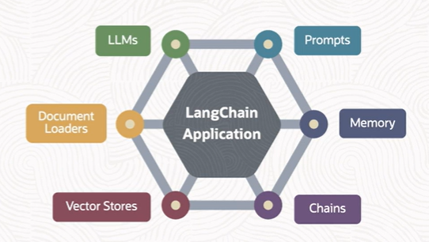

# LangChain

**LangChain** is one of the most popular LLM application development framework to build a chatbot.

It enables applications that are context aware and rely on language model to answer given the question and the context. 

It offers multitude of components that help us build LLM-powered applications with minimal effort.

A few components are:
- LLMs
- prompts
- memory
- chains
- vector stores
- document loaders 

These components are **easily exchangeable** as well. For example, we can switch between, say, one LLM with another LLM with minimal code changes.

## LangChain Models

 There are two main types of models that LangChain integrates with:
 - **LLMs**
    - they refer to **pure text completion models**
    - they take a string prompt as input and output a string completion
    
 - **Chat Models**
    - they are often backed by LLMs but **tuned specifically for having conversations** (i.e. exchange of messages)
    - they take a list of chat messages as input, and they return a message as output

## LangChaing Prompts

LangChain has pre-built classes to create prompts. These are called as **prompt templates** and they are **predefined recipes for generating prompts** for language models.

Tipically, language models expect the prompts to either be a *string* or else a *list of chat message*:
- **String Prompt Template** 
    - it creates the input from a combination of fixed text input and variables
- **Chat Prompt Template**
    - it creates the input from a list of chat messages
    - each chat message is associated with *content* and an additional parameter called *role*

E.g. String Prompt Template

    prompt_template = PromptTemplate.from_template(
        "Tell me a {adjective} joke about {content}."
    )

E.g. Chat Prompt Template

    chat_template = ChatPromptTemplate.from_messages(
        [
            ("human", "Hello, how are you doing?"),
            ("ai", "I'm doing well, thanks!")
        ]
    )

## LangChain Chains

LangChain provides framework for creating **chains of component**, including LLMs and other type of components. 

Chains can be composed in two ways:
- **LangChain Expression Language (LCEL)**
    - it is a declarative and preferred way to create chains
- **Legacy** 
    - LangChain Python classes like LLM Chain

## LangChain Memory

In the context of chatbot and LangChain, **memory** is the ability to store information about past interactions.

LangChain interacts with the memory **twice** in a run:
- after user input but before chain execution  
    - read from memory
- after core logic but before output
    - write to memory

LangChain offers a **variety of memory types**. For example, we may use a chain that returns a summary of the contents of the memory instead of the actual contents of the memory.

When multiple users are using a chatbot, every user will ask different questions and will have different responses. So how do we store these? If we use *Streamlit* as our user interface, **a separate session is created** for every connected user. We can store chat history in user-specific session. 

## RAG with LangChain

LLMs are trained on a vast amount of data, but LLMs are also limited by the data that they're trained on. LLMs will not have knowledge of your custom data. 

For building applications that can answer questions about your custom data, we need to provide that data to the LLMs. The process of inserting relevant custom data into the prompt so that it can be passed onto the LLM is called as Retrieval Augmented Generation (RAG).

RAG is split into two parts:
- **indexing**
    - load documents (e.g PDFs, CSVs, etc.)
    - split documents 
    - embed and store 
- **retrieval and generation**
    - retrieve documents
    - generate output