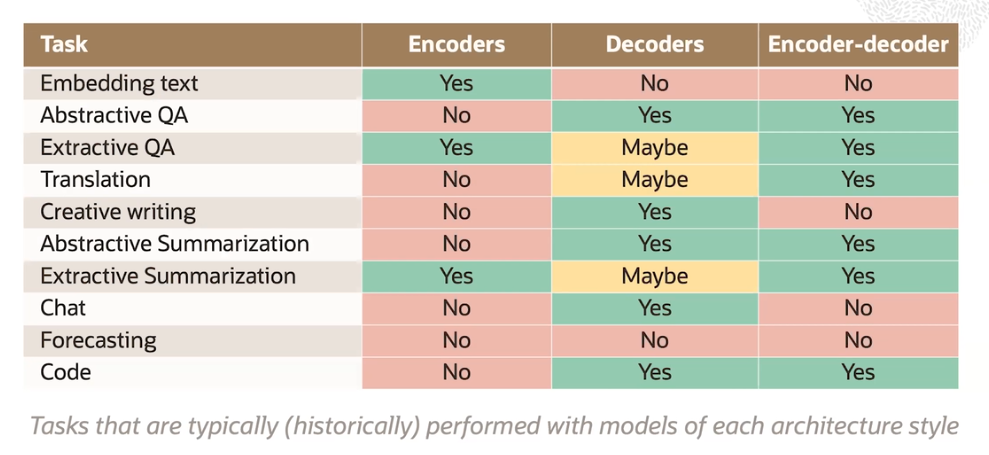

# LLM Architectures

The are two major architectures for language models:
- **encoders**
- **decoders**

These architectures largely correspond to two different tasks or model capabilities:

- **embedding** 

    Embedding text is the process of converting a sequence of words into a single vector or a sequence of vectors. In other words, an embedding of text is a **numeric representation of the text** that typically tries to capture the semantics or meaning of the text. 

- **text generation**

    Text generation is pretty self-explanatory. The input to a text generation model is a sequence of words, and the output is a generated sequence of words.

These models are based on an underlying **transformer architecture**, which was popularized in the paper *Attention Is All You Need* which came out in 2017.

Encoders and decoders can come in all different kinds of sizes. In the realm of language models, **size refers to the number of trainable parameters** that the model has. The decoder models tend to be pretty large, especially compared to the relatively smaller encoders. However, recent research has shown glimmers of this pattern changing.

## Encoders

Encoders are models that **convert a sequence of words to an embedding** (vector representation).

Primary uses:
- embedding tokens, sentences and documents
- semantic search

What is a **semantic search** ? 

Let's say you want to take an input text snippet and retrieve a similar document from a corpus. To accomplish this, you could encode or synonymously embed each document in the corpus and store them in an index. When you get the input snippet, you encode that too and **check the similarity of the encoded input against the similarity of each document in the corpus**. And then you return the most similar.

## Decoders

Decoders are models that **take a sequence of words and ouput next word**.

We can always invoke a decoder over and over to generate as many new tokens as we want. Given the size of these models, this is computationally **very expensive**. 

Primary uses:
- text generation
- chat-style models

## Encoders-Decoders

Encoder-decoder are models that **encodes a sequence of words and user the encoding to output a next word**.

Primary uses:
- sequence-to-sequence task (e.g. translation)

## Architectures at a glance

You could, in theory, use any model to complete any task, but the pair may not be appropriate and is not traditionally done in practice. 

At a high level, the main takeaway here is that there are a variety of tasks that we could use language models for and different styles of models are deliberately selected to accomplish various tasks.

