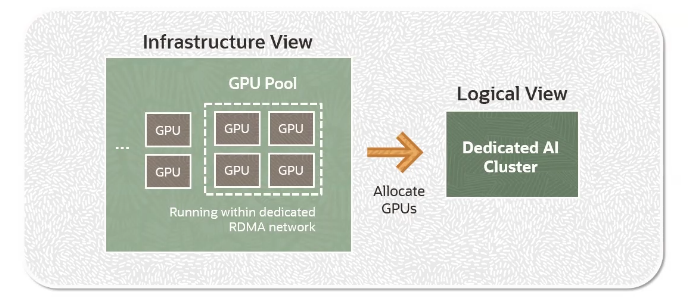

# OCI Generative AI

**OCI Generative AI** service is a **fully managed service** that provides a set of customizable LLMs available via single API (i.e. minimal code change) to build generative AI applications.

The service provides:
- **choice of models**: high performing and pretrained foundational models from **Cohere** and **Meta**
- **flexible fine-tuning**: fine-tuning foundational models with your own data set
- **dedicated AI clusters**: GPU based compute resources that host your fine-tuning and inference workloads

## How does OCI Generative AI service work ?

The service is built to undestand, generate, and process human language at a massive scale.

Some of the use cases:
- text generation
- text summarization
- data extraction
- data classification
- conversation

## Pretrained Foundational Models

- **Generation Models** (text generation)
    - `command` from Cohere
    - `command-light` from Cohere
    - `llama-2-70b-chat` from Meta
- **Summarization Models** (text summarization)
    - `command` from Cohere
- **Embedding** (convert text to vector embeddings)
    - `embed-english-v3.0` from Cohere
    - `embed-english-light-v3.0` from Cohere
    - `embed-multilingual-v3.0` from Cohere
    - `embed-multilingual-light-v3.0` from Cohere

## Fine-Tuning 

A key capability of the OCI Generative AI service is the ability to fine-tune pretrained foundational models with domain-specific data set.

OCI Generative AI services uses the **T-Few fine-tuning** to enable fast and efficient customizations. *T-Few fine-tuning* is a parameter efficient fine-tuning technique where only a portion of model's weight is updated. This gives you results which have **better accuracy** at significantly **lower cost**.

There are two benefits to doing fine-tuning:
- improve model performance on specific tasks
- improve model efficiency

## Dedicated AI Clusters

Dedicated AI clusters are GPU-based compute resources that hosts the customer's fine-tuning and interface workloads.

The GPU allocated for a customer's generative AI tasks are isolated from other GPUs.

