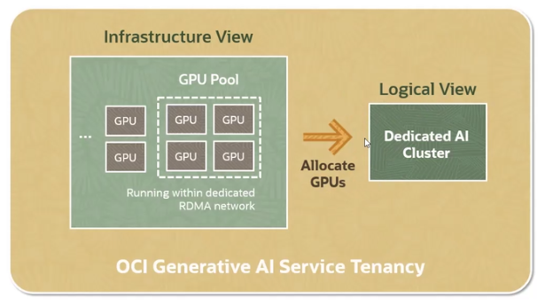
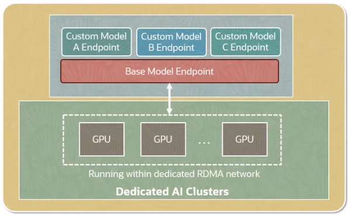
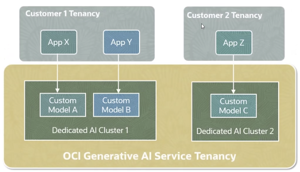
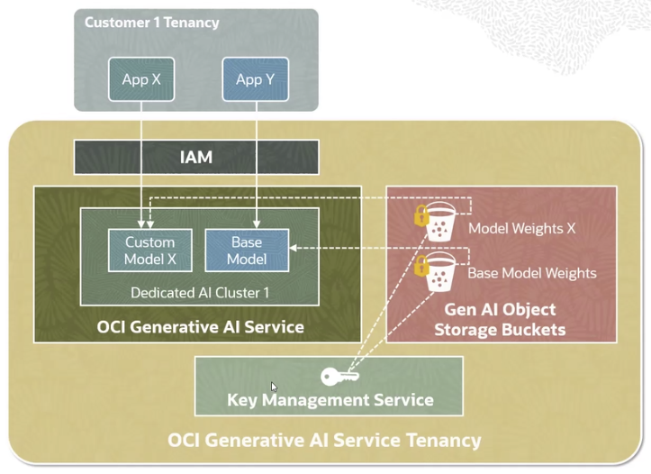

# OCI Generative AI Security

The GPUs allocated for a customer's generative AI tasks **are isolated** 
from other GPUs. They are dedicated and not shared across customers.

## Model Endpoints

For strong data privacy and security, a dedicated GPU cluster only handles fine-tuned models of a single customer.

Base model + fine-tuned model endpoints share the same cluster resources for the most efficient utilization of underlying GPUs in the dedicated AI cluster.

## Customer Data and Model Isolation

Customer data access is restricted within the customer's tenancy, so that one customer's data can't be seen by another customer.

Only a customer's application can access custom models created and hosted from within that customer's tenancy.

## Generative AI leverages OCI Security Services

Generative AI leverages OCI Security Services:
- **OCI IAM** for Authentication and Authorization
- **OCI Key Management Service** for base model keys storage
- **OCI Object Storage Buckets** for fine-tuned customer models weights storage

