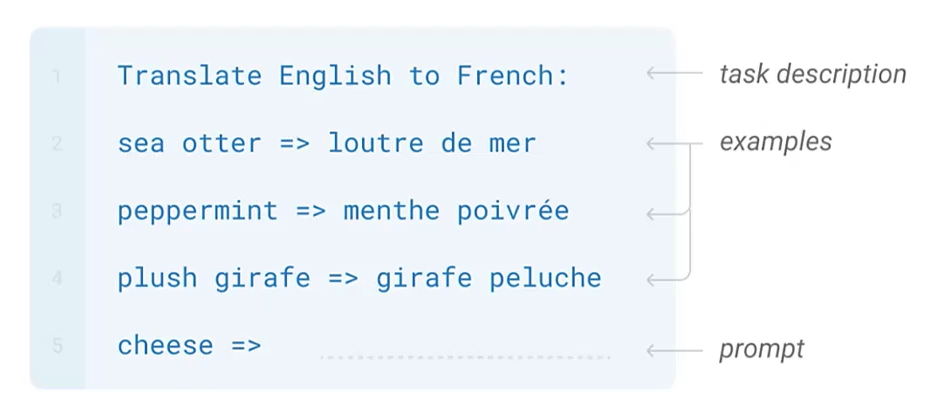

# Prompt Engineering

Prompt engineering is the **process of iteratively refining a prompt** for the purpose of eliciting a particular style or a particular type of response from the LLM.

Text prompts are how users interact with LLMs. LLMs attempt to produce the next series of words that are most likely to follow from the previous text.

Completition LLMs are trained to predict the next word on a lage dataset of internet text, rather than safely perform the language task that the user wants. You cannot give instructions or ask questions to a completition LLM. Instead you need to formulate your input as a prompt whose natural continuation in your desired output. **This is not practical!**

In today's context, most of the LLMs can follow instructions because those models are fine-tuned. **Reinforcement Learning from HUman Feedback (RLHF)** is a model training procedure that is applied to a fine-tuned language model to further align model behavior with human preferences and instruction following.

*Llama-2 foundational models were trained on a data set with 2 trillion tokens (the base model). Llama-2-chat is a different model than the base model. It was additionally fine-tuned on something like 28,000 prompt response pairs created for this particular project. To align Llama-2 to follow instructions, what we refer to as **AI alignment**, RLHF was used with a combination of more than 1.4 million meta examples and 7 smaller data sets.

## In-context learning and Few-shot Prompting

Prompt engineering is challenging, but it can also be successful. There have been many successful strategies for generating prompts that are useful and successful for specific tasks and particular models. 

**In-context learning** means conditioning (prompting) an LLM with instructions and or demonstrations of the task it is meant to complete. It is not learning in the traditional sense as none of the model parameters are changing.

***k*-shot prompting** means explicitly provinding *k* examples of the intended task in the prompt. Few-shot prompting is widely believed to improve results over zero-shot prompting.

## Prompt Formats

LLMs are trained on a specific prompt format. If you format prompts in a different way, you may get odd/inferior results.

    <<s>>                   -- beginning of entire sequence
    [INST]                  -- begininng of instructions
        <<SYS>>
        {{system_prompt}}   -- system prompt to set model context
        <</SYS>>
        {{user_message}}    -- user message specifying instructions to the model
    [/INST]                 -- end of instructions

## Advanced Prompting Strategies

- **Chain-of-Thought** 
    - provide examples in a prompt to show responses that include a reasoning step
    - the model accomplish complex tasks that involve intermediate reasoning
- **Zero Shot Chain-of-Thought**: apply chain-of-thought prompting without providing examples