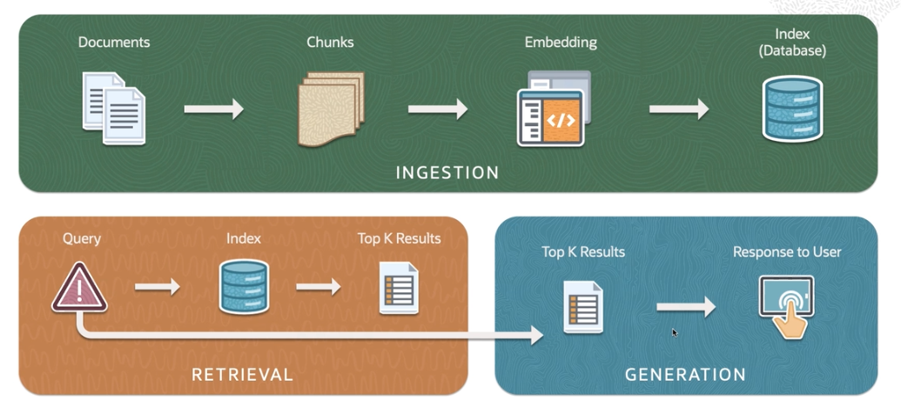
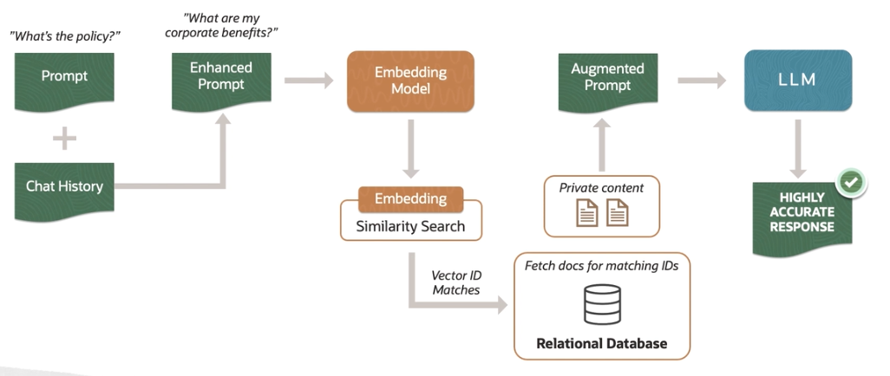
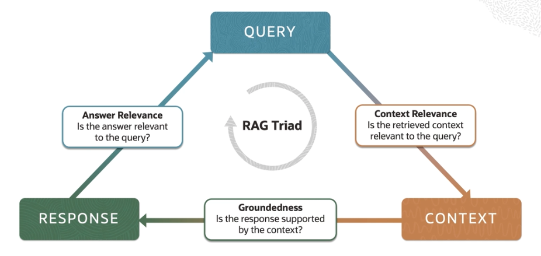

# Retrieval Augmented Generation (RAG)

**Retrieval Augmented Generation (RAG)** allows LLMs to handle a broader range of queries without the need of exponentially large training data sets.

One of the limitations of standard LLMs is the reliance on the knowledge they were trained on. That knowledge might be outdated and it also falls short in tasks requiring a specific information. **RAG address this by retrieving up-to-date information from external sources**, thus enhancing the accuracy and relevance of the information it provides.

RAG can significantly improve performance by retrieving documents or data that contain the exact information needed, something that pure generative models might struggle with. RAG models retrieves documents and pass them to a sequence-to-sequence (i.e. *seq2seq*) model, such as encoder-decoder architecture. A sequence-to-sequence model is particularly effective for tasks where the input and output sequences can have different lengths, such as machine translation, text summarization, and conversation modeling.

## RAG Framework

1. **Retriever**
    
    This component is responsible for sourcing relevant information from a large corpus or database. 
    
    It acts like a search engine, scanning through vast amounts of data to find content that is pertinent to the query at hand. It uses retrieval techniques, such as vector similarity search, keyword-based search, document retrieval or structured database queries to fetch data. 

    The goal is to provide the generation system with **contextually relevant, accurate, and up-to-date information** that might not be present in the model's pre-trained knowledge.

2. **Ranker**

    This components's primary role is to evaluate and prioritize the information retrieved by the retrieval system. It sifts through the various pieces of data or documents that the retrieval system has gathered and ranks them based on their relevance and usefulness in answering the given query.

    The ranker ensures that the generation system receives the most pertinent and high quality input. This step is crucial for maintaining the accuracy and relevance of the responses generated by the model. 
    
3. **Generator**

    This is a language model, whose job is to generate human-like text based on the input it receives.

    It employs generative models to craft human-like text that is contextually relevant, coherent, and informative. It ensures that the final response is not only factually accurate and relevant but also coherent, fluent, and styled in a way that is typical of human language. 

## RAG Techniques

There are two ways to implement RAG:

1. **RAG Sequence Model**

    For each input query (like a chapter topic), the model retrieves a set of relevant documents or information. It then considers all these documents together to generate a single cohesive response (the entire chapter) that reflects the combined information.

    *Imagine you are writing a chapter about the French Revolution. You gather several books and articles on the topic, you read them all, and then write the entire chapter.*

2. **RAG Token Model**

     For each part of the response (like each sentence or even each word), the model retrieves relevant documents.The response is constructed incrementally with each part reflecting the information from the documents retrieved for that specific part. 
     
     *Imagine you are writing an article about a complex topic, such as climate change. For each point you make or each sentence you write, you look up specific articles or data to ensure that part of your story is accurate and relevant.*

So what are the key differences? And what is the scope of retrieval in those two cases?

The RAG sequence considers the entire input query at once for retrieval, while RAG token does this at more granular level, potentially leading to more varied and specific information integration. On the topic of response generation, RAG sequence is more about synthesizing a holistic response from a batch of information, whereas RAG token constructs the response in a more piecemeal fashion, considering different sources for different parts of response.

## RAG Pipeline

The RAG architecture combines a retrieval-based component with a generative model to enhance the generation of text. This approach is particularly useful in scenarios where generative models need to be supplemented with specific information that may not be present in their training data.

The first phase is **ingestion**, where documents are ingested into the system. The documents are  broken down into a smaller, more manageable piece, often referred to as **chunks**. This is typically done to improve the efficiency of processing and to focus on relevant sections of the text. Each chunk is then transformed into a mathematical representation called an **embedding**. These embeddings are then **indexed** in a database that facilitates quick retrieval. 

In the next phase, the system uses the indexed data to find relevant information. **Query** is a user's input or question that need to be answered. The system uses this query to search through this indexed embeddings from the ingestion phase to find the most relevant chunks. From the retrieval process, the system selects the **top K most relevant results**, which are the chunks that are most likely to contain information relevant to the query. 

The third and final phase is **generation**. This is where the system generates a response based on the information retrieved. The selected chunks from the retrieval phase are fed into the generative model. The generative model, often a neural network like a transformer, uses the context provided by this top k chunks to generate a coherent and contextually relevant response to the query. 

## RAG Application

The RAG model combines the context of the conversation with specific retrieve information to produce responses that are precise and reliable. 

## RAG Evaluation

Even though RAG have the access to the most updated database and gives accurate answers, it does not fully eliminate **the risk of hallucinations** for various reasons: 
- the retrieval could simply fail to retrieve sufficient context or get the relevant one
- the response generated by a RAG application was not supported by the retrieved context, but would have been mostly influenced by the LLM and its training data

For these, **RAG triad** comes handy:

1. **Context Relevance**

    It refers to how well the RAG responses are aligned with the context of the conversation. This includes understanding the ongoing dialogue, the user's intent, and any background information or conversational history. A RAG application with high context relevance can maintain a coherent and meaningful conversation over multiple turns.

    Accurately interpreting the user's queries is often assessed through user feedback or by analyzing conversation logs.

2. **Groundedness**

    It indicates the chatbot's ability to provide responses that are not only plausible but also accurate and based on reliable information. 
    
    It can be evaluated by comparing the RAG responses to trusted sources of the information or through expert assessment, especially for domain specific applications. 
    
3. **Answer relevance** 

    It refers to the degree to which the RAG responses directly address the user's queries. It's about providing responses that are not only contextually appropriate, but also specifically answer or relate to the user's questions or statement.
    
Overall, leveraging these three parameters over the query, context, and response, one can minimize hallucinations and make RAG-based applications more reliable.

