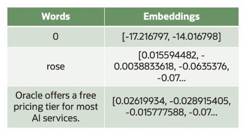
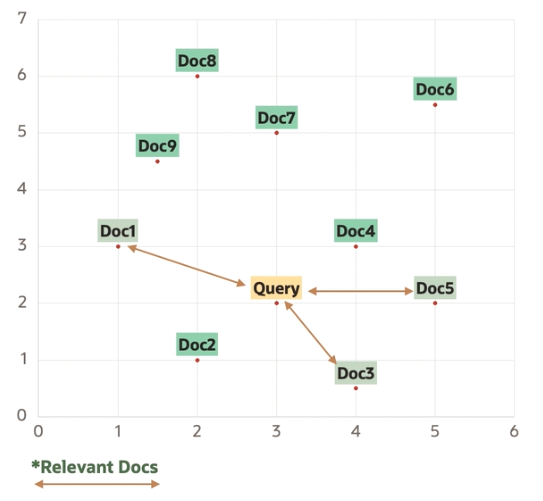
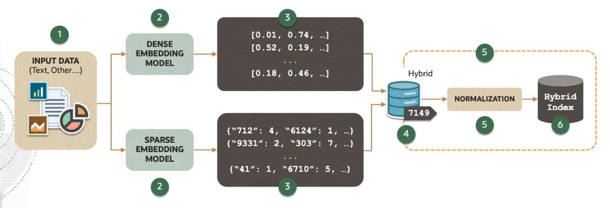

# Semantic Search

Semantic search is **search by meaning**. It is a name given to search algorithms in which the retrieval is done by **understanding the semantics of the text**, rather than matching keywords.

The two ways to leverage semantic search are:
- **dense retrieval**: uses text embeddings (*)
- **reranking**: assigns a relevance score

## Embeddings

Embeddings represent the **meaning of text as a list of numbers**.

Embeddings encompass thousands of numbers. Each number represent a piece of information about the meaning contained in the piece of the text.

The main purpose of embeddings is to capture the essence of the data in a lower dimensional space that a computer can process, while maintaining the semantic relationships and meaning. 

With embeddings, you can compare two or more pieces of text, be it single word, sentences, paragraphs, or even longer documents.

## Dense Retrieval

Dense retrieval consists of the following:
1. it finds the embedding vector corresponding to the query
2. it finds the embedding vectors corresponding to each of the responses
3. it retrieves the response vectors that are closest to the query vector in the embedding

Dense retrieval relies on embeddings of both the queries and documents. This enables the retrieval system to understand and match based on the contextual similarities between queries and documents. 

## Reranking

Reranking, in context of information retrieval and machine learning is a process that takes an initially retrieved set of items (e.g. search results, documents, images, etc.) and **reorders them to improve the relevance or quality of the results**.

Reranking assigns a relevance score to query-response pairs from initial search results. The relevance score is high when the response is likely to be correct response to the query and low otherwise.

Reranking is **implemented through an LLM**. The way to train this model is giving it positive and negativa query-response pairs and training the model to score positive pairs highly and negative pairs low.

## Hybrid Search: Sparse + Dense

Hybrid search can combine the precision of keyword-based retrieval, which is also called *sparse search*, with the broad understanding of the semantic search, which is also called as *dense search*. 

For example, a system can first use keyword search to quickly narrow down the pool of relevant documents from a large corpus and then apply vector search within this subset to identify the most semantically relevant documents based on embeddings. 

1. The pipeline starts with the **data**, which consists of text.
2. Part of the input data is processed by a **dense model**. This model generates a dense vector representation of the input where each piece of data is transformed into a vector with continuous values. Dense embeddings capture the semantic meaning of the input data in a high dimensional space. 
3. Simultaneously, another part of the input data is processed by **sparse model**. This model creates sparse vector representation, which are typically high dimensional as well but with many zero values. These vectors might represent the presence of frequency of certain words or features.
4. The vectors produced by both the dense and sparse embedding models are then fed into what is labeled as a **hybrid component**. This could be a vector database service that supports hybrid search. Usually, this also has an associated parameter called *alpha*, where you can control how much dense or sparse you want the index or this model to be. 
5. Before being indexed, the vectors are also **normalized**. Normalization is a crucial step in preparing vectors for search operations, as it typically ensures that the vectors have unit length. This standardizes the vector lengths, making it possible to compare them meaningfully using metrics, like cosine similarity, which calculates on cosine distances.
6. Finally, the normalized vectors are stored in a **hybrid index**, which is a data structure capable of handling both dense and sparse vectors. This hybrid index enables efficient retrieval operations that can leverage the strengths of both dense semantic search and sparse keyword search.

By leveraging best of both worlds, hybrid search can achieve higher accuracy in document retrieval. Keyword-based filters can quickly reduce the search space, making it faster to apply semantic search on a smaller, more relevant subset. 

