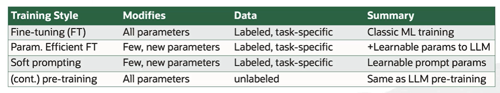
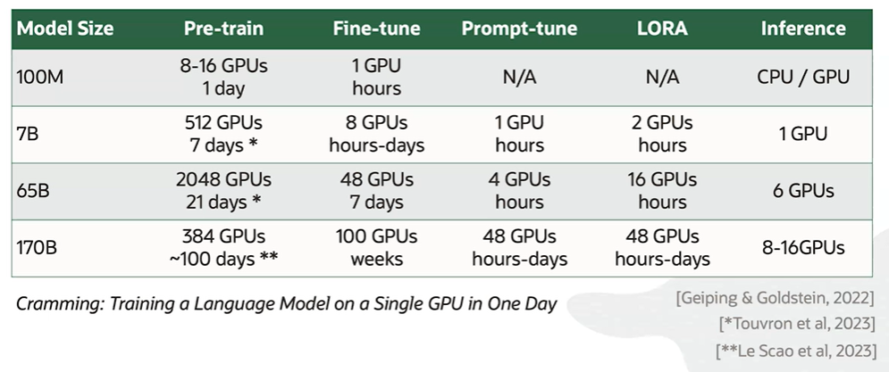

# Training

Prompting is not the only option to affect the model's distribution over vocabulary words. In fact, a more significant way to alter the distribution over vocabulary is **training.**

Prompting alone may be inappropriate when:
- training data exists
- domain adaption is required

At a high level, you can think of training as the process of giving the model an input, having a guess a corresponding output, for example the completion of a sentence or an answer to an input question, and then, based on this answer, altering the parameters of the model so that next time it generates something closer to the correct answer.

There are many ways that you can train or, in other words, change the underlying parameters of the model. Four such approaches are shown in this chart, and they all come with their own advantages and costs.

## Fine-Tuning (FT)

In **fine-tuning**, we take a pre-trained model, for example BERT, and a labeled dataset for a task that we care about and train the model to perform the task by altering all of its parameters. 

Training a BERT model was, at the time (2019), thought to be somewhat **expensive**. But it's nowhere near as expensive as training the models of today, which are orders of magnitude larger.

## Parameter Efficient Fine-Tuning (FT)

Because full fine-tuning is so expensive, we've turned to cheaper alternatives, like the family of **parameter efficient fine-tuning** methods. In these methods, we isolate a very small set of the model's parameters to train, or we add a handful of new parameters to the model. 

One of the methods is **LORA (Low Rank Adaptation)**. In this method, we keep the parameters of the model fixed and add additional parameters that will be trained.

## Soft Prompting

**Soft prompting** is another cheap training option. In soft prompting, what we're going to do is actually add parameters to the prompt, which you can think about as adding very specialized *words* that will input to the model in order to queue it to perform specific tasks. 

Unlike prompting, a **soft prompt is learned** or in other words, the parameters that represent those specialized words we added to the prompt are initialized randomly and iteratively fine-tuned during training. 

## Continual Pre-Training

**Continual pre-training** is similar to fine-tuning in that it changes all the parameters of the model.

It's **expensive**, but it's different in that it **does not require a label data**. Instead of training a model to predict specific labels, during continual pre-training, we just feed in any kind of data that we have for any task that we have and ask the model to continually predict the next word.

If we're trying to adapt a model to a new domain, let's say, from general text to a specialized domain of science, continually pre-training or simply training the model to predict the next word in millions of sentences from that specialized scientific domain can be pretty effective.

## Hardware costs of training

