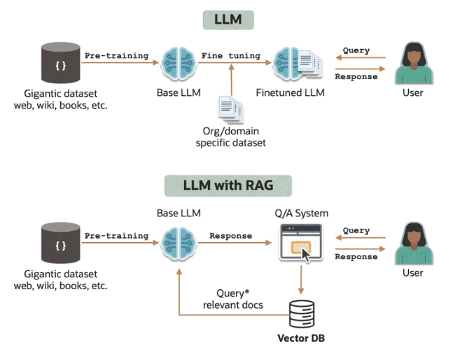
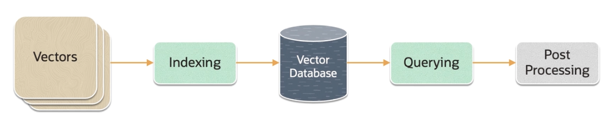

# Vector Databases

LLMs without RAG rely on internal knowledge learned during pre-training on a large corpus of text. It may or may not use *fine tuning*. 

LLMs with RAG use an external database, which is a **vector database**. They are a type of **database optimized for storing and querying vectors instead of a traditional row-based**.

Vector database and the concept of indexing and vectors, which are high-dimensional data have been used **before LLMs**. Search engines have used vector space models for decades to represent text documents for similarity searches and ranking.

## Vectors

A vector is a sequence of numbers, called **dimensions**, used to capture the importat **features** of the data.

In the context of ML and particularly with large ML models, vectors are often used to represent **embeddings**, which are essentially **high dimensional vectors**.

Vector embeddings are generated by deep learning models to capture semantic meaning of words, sentences, documents, images, or other data types. 

Vectors can be used to **compute similarity between items efficiently**.

## Vector Databases

The structure of vector databases is fundamentally different from traditional relational databases. They are **optimized for multi-dimensional spaces**, where the relationship between data points is not linear or tabular, but is instead based on distances and similarities in a high-dimensional vector space.

Vector databases are particularly adept at handling operations that involve searching the meaning and nearest neighbor queries in high-dimensional spaces. 

Many vector databases uses a distributed architecture to handle the storage and computational demands of large scale high-dimensional data. This setup allows for horizontal scaling, improving performance and storage capacity.

## Embedding Distance

*Dot Product* and *Cosine Distance* are commonly used in the field of NLP to evaluate how similar or different two text embeddings are.

**Dot Product** is the measure of the magnitude of the projection of one vector onto the other and gives you magnitude and direction.

**Cosine Distance** is the measure of difference in the directionality between vectors so that only the angle between the vectors matters, not their magnitude.

*Imagine you and your friend are pushing a car. The **Dot Product** helps us understand how much of your pushing effort influences the movement of the car in the same direction that your friend is pushing and vice versa. A high positive value means both are pushing in a very similar direction, suggesting that their embeddings are similar. A low value that is close to 0 means they are pushing in more orthogonal or unrelated directions, so their embeddings are not that similar. A negative value means they are pushing in opposite directions, indicating their embeddings are dissimilar. **Cosine Distance** refines this by focusing only on the direction, not on the strength of the push. This is particularly useful when we care about the orientation of the items to each other rather than their magnitude, which might represent the strength or frequency of occurrence in data depending on the context. A cosine distance of 0 means that you both are pushing in the same direction, and the embeddings are similar. A cosine distance of 1 means your efforts are, again, orthogonal, so the embeddings are unrelated.*

## Similar Vectors

**K-Nearest Neighbors (KNN)** algorithm can be used to accurately obtain the nearest vectors in embedding space to a query vector to perform a vector or semantic search. Given a query, the distances between all the vectors and the query vector are calculated. Then those distances are sorted. Finally, the top-k best matching objects with the best distance are returned. 

KNN algorithm is a known classical machine learning method, but it's not feasible for real life applications due to use computation costs, which might be incurred due to a large vector database. Also, this will be too slow. For those reasons, **Approximate Nearest Neighbor (ANN)** algorithms are used, which are designed to find nearest optimal neighbors much faster than exact KNN searches.

The choice of algorithm depends on several factors, including the size of the data set, the dimensionality of the vectors, and the desired balance between accuracy and speed. ANN methods are often preferred for large scale similarity search tasks in embedding spaces due to their efficiency. 

## Vector Databas Workflow

Vectors represent the data set of high-dimensional vectors that need to be stored and queried. They encapsulate rich, context-aware information about the data. 

Vector database indexes these vectors using an algorithm such as HNSW (ANN). This step maps the vector to a data structure that will enable faster search. A vector database is optimized to handle the high-dimensional nature of the data, enabling efficient storage, search, and retrieval operations.

The vector database compares the indexed query vector to the indexed vectors in the data set to find the nearest neighbors. When a query vector is submitted to the system, the vector database performs a search to find the most similar vectors. Similarity is typically measured using distance metrics like *Cosine Similarity* or *Cosine Distance*.

In some cases, the vector database retrieves the final nearest neighbors from the data set and post-processes them to return the final results.

## Vector Databases Features

1. **Accuracy**

    **Vector databases store data in a way that preserves semantic relationships**, which is crucial for the accuracy of language models. Traditional databases may not effectively capture these nuanced relationships.

2. **Latency**

    **Vector databases are optimized for quick retrieval of high-dimensional data**, a key requirement for reducing latency in LLMs. Traditional databases might not offer the same level of efficiency in data retrieval. The indexing mechanisms in vector databases are designed for the efficient searching of high-dimensional data and this efficiency is crucial for reducing the response time of LLMs in real time applications.

3. **Scalability**

    LLMs handle enormous data sets. Traditional databases struggle with the sheer volume of the data and its high-dimensional nature. Vector databases, however, are specifically designed for this scale, which efficiently manage large volumes of complex data.

## Roles of Vector Databases with LLMS

- Address the *hallucination* (i.e. inaccuracy) problem inherent in LLM responses
- Augment prompt with enterprise-specific content to produce better responses
- Avoid exceeding LLM token limits by using most relevant content 
- Cheaper than Fine-Tuning LLMs, which can be expensive to update
- Real-time updated knowledge base
- Cache previous LLM prompts/responses to improve performances and reduce costs